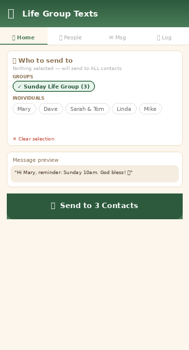
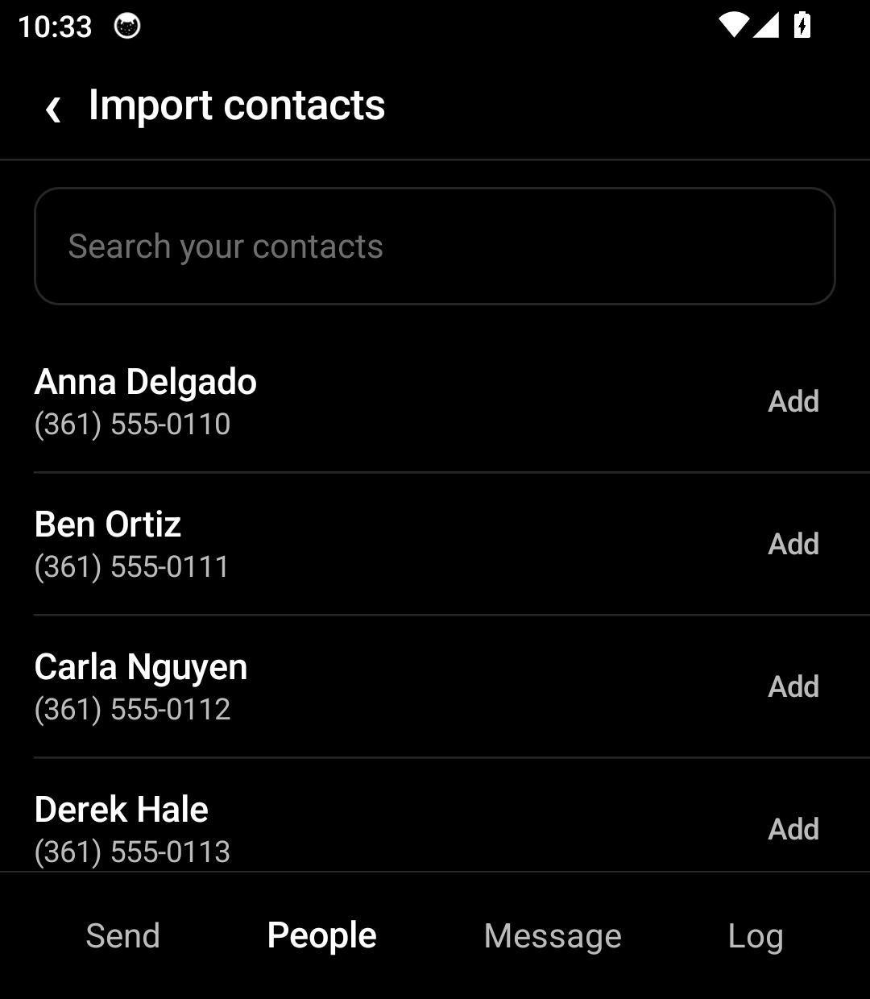
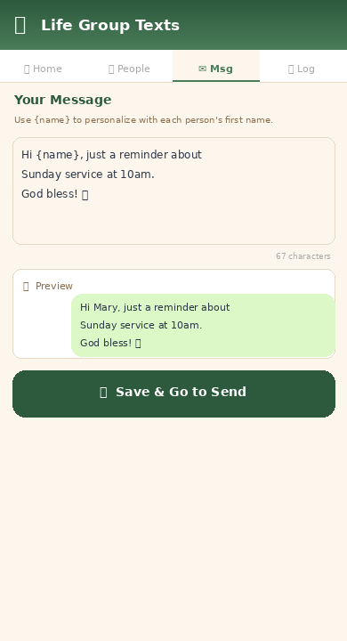

# 📖 Life Group Texts

A simple, clean Android app for sending personalized SMS reminders to your church life group — straight from your own number, no third-party services needed.

---

## Screenshots

| Home | People & Groups | Import from Phone | Compose Message |
|------|----------------|-------------------|-----------------|
|  |  |  |  |

---

## Features

### 📤 Smart Sending
- Send to everyone, a specific group, or hand-picked individuals
- Select groups and individuals in any combination from the Home screen
- Personalized messages — use `{name}` and it gets replaced with each person's first name automatically
- Progress overlay shows how many messages have been sent in real time

### 👥 Groups & Contacts
- Create named groups like "Sunday Life Group" or "Wednesday Bible Study"
- Tap any group folder to expand it and add/remove members
- Add contacts manually with name and phone number (area code required)
- Import directly from your phone's saved contacts with a searchable picker
- Already-added contacts show as "Added" so you never duplicate

### ✉️ Message Composer
- Write your message once, send to everyone
- Live preview shows exactly how the message will look with a real name filled in
- Character counter to keep messages concise

### 📋 Send Log
- Full history of every message sent — name, number, message content, and timestamp
- Keeps a running log across sessions

---

## How It Works

1. **Add your contacts** — manually or import from your phone
2. **Create groups** — organize contacts into life groups
3. **Write your message** — personalize with `{name}`
4. **Choose recipients** — select a group, individuals, or send to all
5. **Tap Send** — messages go out automatically using your own phone number

---

## Build Instructions

### Requirements
- Node.js
- Android Studio
- Java JDK 17

### Steps

```bash
# Install dependencies
npm install

# Build the web app
npm run build

# Add Android platform
npx cap add android
npx cap sync

# Open in Android Studio
npx cap open android
```

Then in Android Studio: **Build → Generate App Bundles or APKs → Generate APKs**

### Install on your phone

```bash
adb install android/app/build/outputs/apk/debug/app-debug.apk
```

Or transfer the APK to your phone and open it with a file manager (enable "Install from unknown sources" in Android settings first).

---

## Permissions Required

| Permission | Reason |
|------------|--------|
| `SEND_SMS` | Send text messages from your number |
| `READ_CONTACTS` | Import contacts from your phone |
| `READ_PHONE_STATE` | Access phone features for SMS |
| `INTERNET` | Load the app interface |

---

## Tech Stack

- **React + Vite** — UI
- **Capacitor** — Android wrapper
- **Native Android SmsManager** — sends real SMS from your number
- **Android Contacts API** — reads your phone's contact list
- **localStorage** — saves contacts, groups, and messages on-device

---

## Privacy

All data stays on your device. No accounts, no cloud, no analytics. Contacts and messages are stored locally and never leave your phone.
