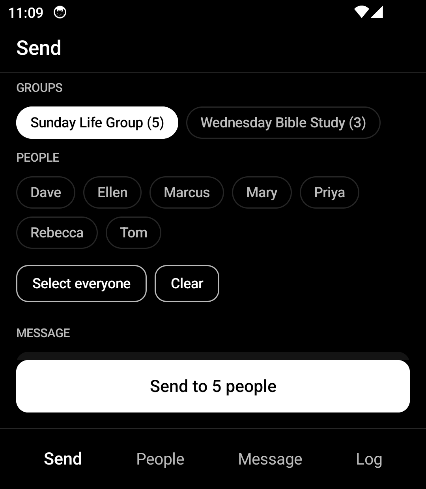
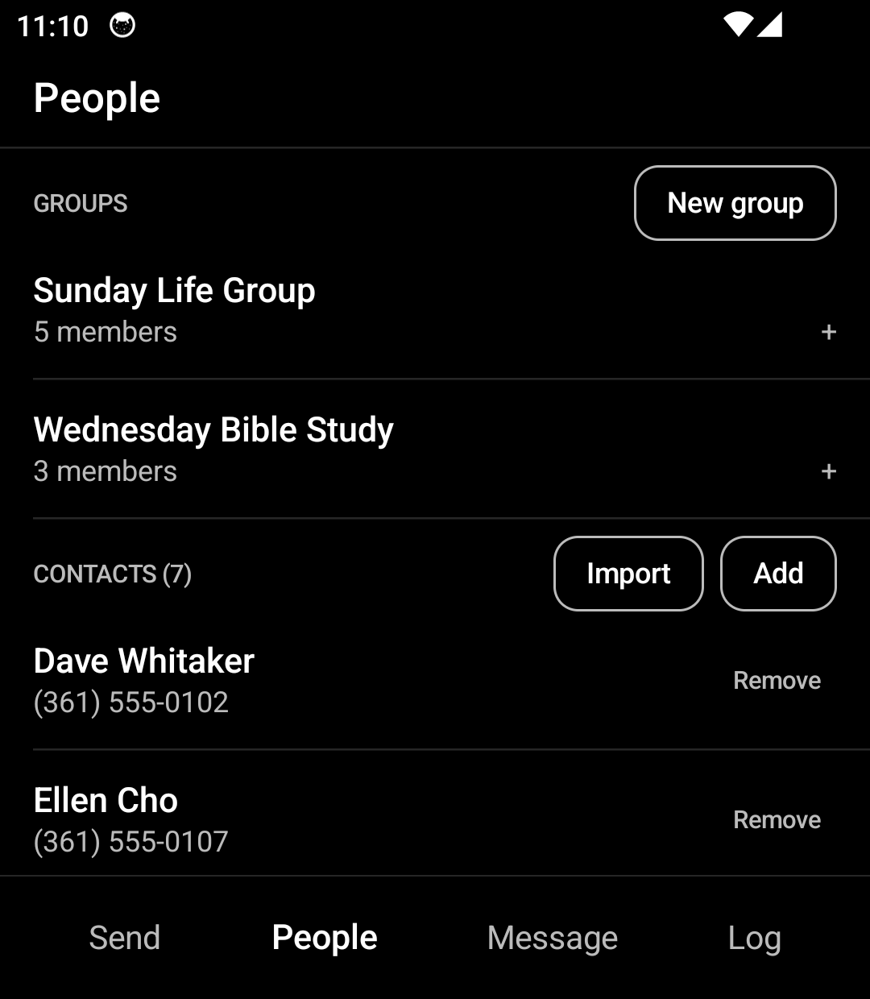
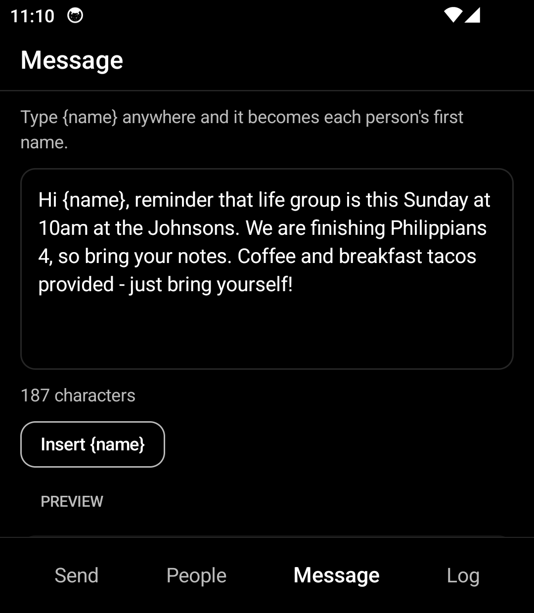
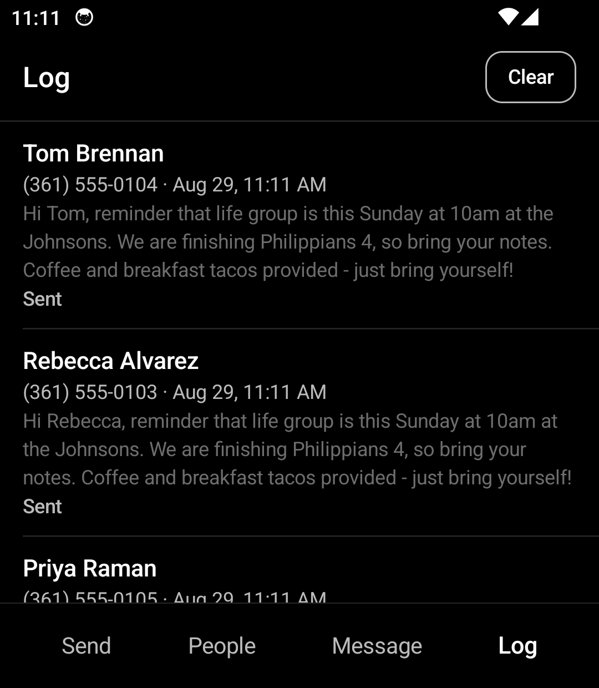

# Life Group Texts

Send one message to your whole church life group, from your own number, on a Light
Phone III. No accounts, no third-party service, nothing leaves the phone.

Built in Kotlin and Jetpack Compose, styled to match LightOS — black ground, white
type, no colour, no icons. A native rewrite of an earlier React + Capacitor version.

| Send | People | Message | Log |
|:----:|:------:|:-------:|:---:|
|  |  |  |  |

## What it does

- **Pick recipients any way you like** — whole groups, hand-picked individuals, or a
  mix. Selecting "Sunday Life Group" and adding two extra people is one tap each.
- **Write once, personalise automatically.** Type `{name}` anywhere in the message and
  each person gets their own first name.
- **Import from your phone.** Pull people straight out of the device's contact list, or
  type them in by hand. Numbers are matched on their last ten digits, so the same
  person saved two different ways won't be added twice.
- **See what actually happened.** The Log records the real result reported by the radio,
  including why anything failed.

## Messages of any length

The previous version silently capped at 160 characters, and messages containing an
emoji or a curly apostrophe failed for no visible reason. Two separate causes:

**Single-segment sending.** It called `SmsManager.sendTextMessage`, which carries
exactly one segment — the radio rejected anything longer. This version uses
`divideMessage` + `sendMultipartTextMessage`, so the phone splits a long message and the
recipient's phone reassembles it into one. Type 500 characters into one box; it arrives
as one message.

**Silent encoding promotion.** SMS uses the GSM 03.38 alphabet, where a segment holds
160 characters. One character outside it — an emoji, a smart quote pasted from a phone
keyboard — switches the *whole* message to UCS-2, where a segment holds 70. Combined
with single-segment sending, a short message could fail with no explanation.

[`SmsText`](app/src/main/java/com/lifegrouptext/sms/SmsText.kt) implements the encoding
rules properly and rewrites smart punctuation to its plain equivalent before sending.
Emoji are left alone — they send correctly now, they just occupy more segments.

The app deliberately does **not** show a segment count. The recipient sees one message
however many segments it took, so the number only ever mattered for per-text billing,
and reporting "3 texts" for one message invites exactly the second-guessing that led to
the old split-message workaround. The composer shows a plain character count.

**Failures are visible.** Every segment reports back through a `PendingIntent`, so the
Log records what the radio actually said — "No cell service", "Radio is off" — rather
than assuming success.

> **On a metered plan, note that carriers bill per segment** — a 400-character message
> to 20 people is 60 texts, not 20. Nothing in the app surfaces this, on the assumption
> of unlimited texting.

## Install

Download [`dist/LifeGroupTexts-0.1.0.apk`](dist/LifeGroupTexts-0.1.0.apk) and sideload it:

```bash
adb install dist/LifeGroupTexts-0.1.0.apk
```

Or copy it to the phone and open it with a file manager, with "install from unknown
sources" enabled. The APK is debug-signed; for a release-signed build, add your own
keystore as `app/keystore.properties`.

## Build

Needs Android Studio (JDK 17–21) and the Android SDK. `local.properties` is
machine-specific and git-ignored — point `sdk.dir` at your SDK.

```bash
./gradlew assembleDebug
```

```bash
./gradlew testDebugUnitTest
```

The unit tests cover the encoding rules — segment maths, GSM vs UCS-2 promotion,
punctuation rewriting — because that is where the original bugs lived.

## Permissions

| Permission | Reason |
|------------|--------|
| `SEND_SMS` | Send texts from your own number |
| `READ_CONTACTS` | Import people from the phone's contact list |

## Design

Palette and type scale ported from the MIT-licensed Light SDK (`:sdk:ui`): background
`#000000`, content `#FFFFFF`, secondary `#BBBBBB`. Akkurat is picked up from the LP3's
system fonts when present and falls back to the platform default elsewhere — it's a
commercial typeface and is deliberately not bundled.

This is **not** a Light SDK tool. `SEND_SMS` and `READ_CONTACTS` aren't on the SDK's
permission allowlist, so a texting app can't be built with it today. This is a plain
Android app that follows Light's design language and is sideloaded.

## Architecture

Compose UI over ViewModels, a Room database, and manual dependency wiring in
[`AppContainer`](app/src/main/java/com/lifegrouptext/di/AppContainer.kt) — no DI
framework, to keep the dependency footprint light.

```
domain/    Contact, Group, phone normalisation, {name} substitution
data/      Room entities, DAOs, repositories
sms/       SmsText (encoding rules), SmsSender (one message), BulkSender (a group)
ui/        One package per screen: send, people, message, log
```

## Privacy

Contacts, groups, the draft message and the send log live in a local Room database on
the device. The app has no network code and no internet permission.
